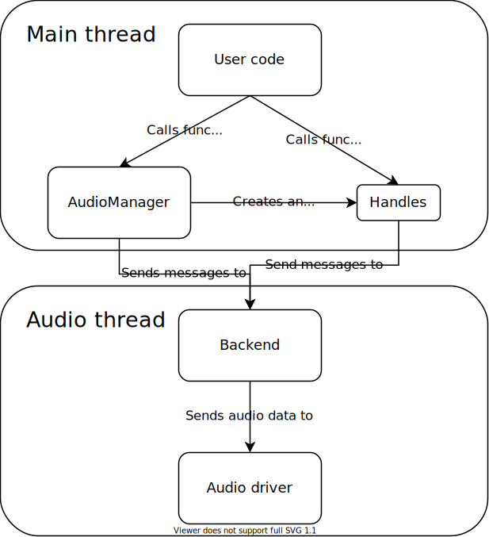
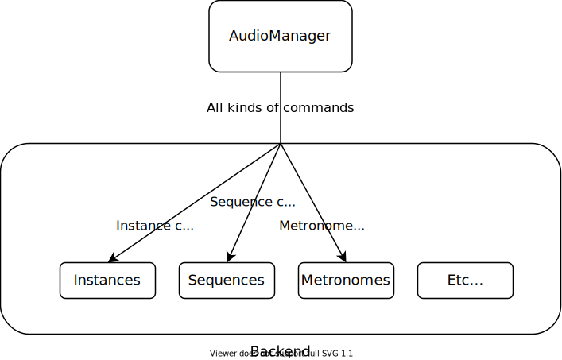

# The general architecture of Kira

The `AudioManager` is essentially a messenger for the `Backend`, which lives on the audio thread. User code calls functions on the `AudioManager`, and the `AudioManager` sends messages through a multi-producer, single-consumer thread channel to tell the `Backend` what to do.

Most `AudioManager` methods create some kind of Thing, and they return handles to those Things. The handles get a clone of the message producer, so they can send messages to the `Backend` as well. Handles send the same kind of messages through the same thread channel as the `AudioManager`. There's nothing special about them; they're an arbitrary organizational tool that makes the user-facing API nicer.

## Why is audio on a separate thread?

Graphics and gameplay code only needs to run at about 60 frames per second. More is better on monitors with higher refresh rates, but 60 FPS is enough for most people to consider the gameplay "smooth". Even if the framerate dips below 60 FPS, it's not a big deal. (*Ocarina of Time* runs at 20 FPS, and it's considered by many to be one of the best games ever made!)

Audio typically needs to be processed at about **48,000 FPS**. And if it ever drops below that amount, you'll hear audio glitches like pops and stutters, which will totally ruin whatever vibe the game is going for. So audio needs to be scheduled separately from your main gameplay code, and it has to avoid doing anything that could take an indefinite amount of time, like memory allocation.

That's why the `Backend`, which does the bulk of the audio processing, lives on a separate thread. Because it's on a separate thread, the `AudioManager` can't call functions on it directly, which is why messages are passed through thread channels.

## Backend and command organization

The `Backend` is responsible for a lot of different things, so to aid in organization, the `Backend` contains a lot of smaller structs that deal with one kind of data. `Command`s (the messages the `AudioManager` sends to the `Backend`) are grouped into categories that correspond to the smaller modules in the `Backend`.
